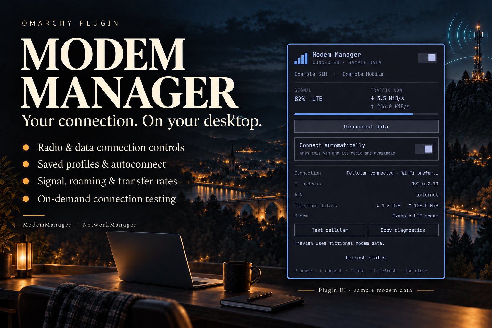
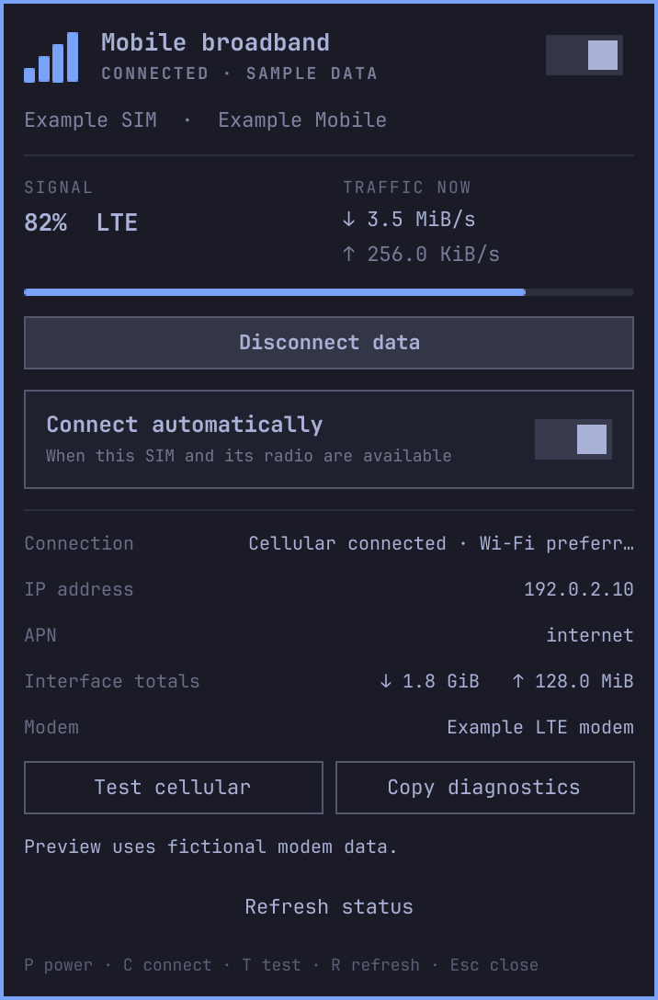

# Modem Manager for Omarchy



## Interface preview

The real QML panel content rendered in Omarchy's dark theme with **fictional
sample modem data**. This is a UI preview, not a live modem capture; no network
connection or hardware settings were changed to produce it.



A native, theme-aware Omarchy bar panel for ModemManager and NetworkManager.
Plugin ID: `jon.modem`. Licensed under MIT.

- Four-bar cellular indicator; click for controls, right-click to toggle radio.
- Power off disables NetworkManager WWAN (preventing autoconnect), disables the modem, and enters low power. Power on restores the radio; saved autoconnect settings apply.
- Connect/disconnect data separately from radio power, choose a saved GSM profile, toggle autoconnect.
- Carrier, SIM provider, roaming, signal freshness, IP, APN, preferred default route, and live transfer rates.
- Interface byte counters are totals since the interface was created/reset, **not billing or monthly usage**.
- Manual HTTPS test bound to the cellular interface. Uses a small request to https://1.1.1.1/ only when clicked; no periodic internet tests.
- Copy local diagnostic status without IMEI, IMSI, ICCID, or credentials. It includes local profile UUIDs, addresses, and traffic counters. Paste once within 60 seconds; the panel stays busy while waiting for the paste.
- Keyboard: arrows/j/k select controls; Enter/Space activate; P power, C connection, T test, R refresh, Escape close. Tab switches shell panels. Profile dropdown has its own keyboard navigation.

Requires Omarchy's Quickshell shell, `python`, `python-dbus`, `modemmanager`, `networkmanager`, `iproute2`, `curl`, `wl-clipboard`, and an active systemd user manager with cgroup support. The panel uses ordinary user D-Bus/Polkit permissions; installing the panel adds no privileged helper or authorization rules. The optional Intel recovery service is documented separately below. It reports authorization errors instead of silently escalating. Each status/action runs as a temporary systemd user service with a deadline, cgroup cleanup, and output limits. There is no unsupervised fallback if the user service manager is unavailable.

Status refreshes every 10 seconds in the background and 3 seconds with the panel open. The background interval can be changed in the widget settings. The panel does not guess SIM PINs or reset modem hardware. On multi-modem systems it selects the most active modem; explicit device selection is not implemented.

## Install

With the dependencies above installed and ModemManager and NetworkManager running:

```bash
omarchy plugin add https://github.com/MariposaJon/omarchy_modemmanager_plugin.git --enable
```

The widget defaults to the right side of the bar. To place it before the
network widget:

```bash
omarchy bar move jon.modem --section right --before omarchy.network
```

Create your cellular connection profile in NetworkManager first; this panel
selects existing compatible GSM profiles. Open and close it through the shell:

```bash
omarchy-shell shell summon jon.modem '{}'
omarchy-shell shell hide jon.modem
```

If you already have a manually copied `jon.modem`, back up any local edits and
run `omarchy plugin remove jon.modem` before installing the repository version.
Omarchy backs up non-git plugin folders during removal.

## Update

```bash
omarchy plugin update jon.modem
```

## Remove

```bash
omarchy plugin remove jon.modem
```

This removes the panel; saved NetworkManager connections remain available.
If you separately installed the optional recovery service, remove it using
the instructions in [recovery/README.md](recovery/README.md).

## Compatibility and validation

Requires the Omarchy Quickshell plugin API (`qs.Ui`, `qs.Commons` and bar-widget
support). Tested on a Fibocom L850 / Intel XMM7360 with a locally patched
ModemManager 1.25.95-2 and an Onomondo SIM. Other modem models and stock
ModemManager versions have not been verified. The panel uses ModemManager's
public D-Bus interface; it does not include modem drivers or the patched
ModemManager build. Your hardware must already be supported by ModemManager.

Verified controls include radio off/on, data disconnect/reconnect, autoconnect,
and cellular-bound HTTPS with Wi-Fi remaining preferred. The power-on action
waits for registration and makes one explicit connection attempt when the
selected profile has autoconnect enabled. It preserves that preference.

From the repository root:

```bash
bash scripts/validate.sh
```

The seven panel backend tests cover profile selection, SIM matching, power
sequencing, hardware blocks, autoconnect, and interface-bound connectivity
testing and bounded clipboard ownership. Five recovery tests cover hardware guards and failure handling. The security suite tests hostile PATH/environment values, unsafe runtime paths and lock files, output floods, process cleanup, and installer symlink attacks.

## Intel modem unavailable after sleep

The panel distinguishes an Intel PCI modem that is visible but unavailable to
ModemManager from absent hardware. On the tested XMM7360, the iosm driver can
return `PORT open refused, phase A-CD_READY` after sleep and leave ModemManager
with no usable modem.

An optional, hardware-specific recovery workaround is in [recovery/](recovery/README.md).
It requires administrator installation and is not installed by the panel setup.
It targets Intel 8086:7360 at PCI address `0000:02:00.0` only.

The validation script runs Omarchy's manifest validator, QML lint, Python syntax
checks, and the backend tests. It needs `qt6-declarative` for `qmllint` and an
installed Omarchy shell. It creates a temporary import alias for Quickshell's
`qs` namespace; no symlinks are added to the plugin directory. Narrow inline
lint annotations cover Omarchy's dynamic font/host properties and Quickshell's
missing `QProcess::ExitStatus` metadata. All other lint warnings remain enabled.

See [VALIDATION.md](VALIDATION.md) for the release checks and remaining hardware
coverage limits.

## Runtime and installation boundaries

The launcher uses `/usr/bin/python3 -I` with a cleared, allowlisted environment.
Helper tools are selected from fixed `/usr/bin` paths and checked for root
ownership and non-writable ancestry. Curl ignores per-user configuration.
Actions require the private logind directory `/run/user/UID` (owned by that
user, mode 0700); there is no `/tmp` lock fallback. Lock opens never truncate or
follow symlinks, and reject hardlinks, special files, and unsafe permissions.

See [SECURITY.md](SECURITY.md) for the detailed limits, trust assumptions, and
regression checks addressing the marketplace review.
